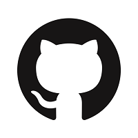
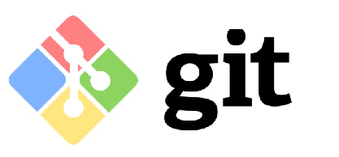
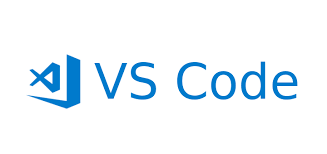

## Useful Resources

| [MySeneca (Blackboard)](https://my.senecacollege.ca/) | [Course Outline](https://apps.senecapolytechnic.ca/ssos/findOutline.do?termCode=08424&subjectCode=CSP451&schoolCode=ITAS) | [Student Services](https://www.senecapolytechnic.ca/about/policies/academics-and-student-services.html) |
| :--- | :--- | :--- |

## GitHub Links

| [CSP451 GitHub](https://github.com/CSP451) | [GitHub Discussions](https://github.com/orgs/CSP451/discussions) | [Assignment Instructions](https://github.com/CSP451/CSP451-ComputerSystemsProject) | [CSP451 Scripts](https://github.com/CSP451/CSP451-Scripts) |
| :--- | :--- | :--- | :--- |

## Onboarding GitHub Organization

You need a GitHub account to submit most of the CSP451 Coursework. The GitHub account you use in this course must be linked to your _@myseneca.ca_ email. You cannot use personal or work GitHub Accounts for this course.

If you have not created a GitHub account using your Seneca email, you can wait until the first day of the class to set it up. If you already have created the GitHub account, make sure to follow the instructions in [Changing your GitHub username](https://docs.github.com/en/account-and-profile/setting-up-and-managing-your-personal-account-on-github/managing-user-account-settings/changing-your-github-username) to update GitHub username and profile name as per course requirements.

### GitHub Username and Profile Name

In this course, it's essential to adhere to the username and profile naming convention. This is because assignments may be marked using an automated marking tool that relies on your username and password from the "GitHub Account Username List" in the Blackboard portal. Ensuring the correct username is used is crucial to avoid any loss of marks.

Your username follows the format `<student_number>-myseneca`, utilizing a hyphen `-` instead of an underscore `_`, and it's case-sensitive. You can also find your GitHub username in the Blackboard Portal, in **Class Information** module in **GitHub Account Username List** Page.

Additionally, please ensure your profile name reflects your full name. As this is an academic course, it's important to maintain a professional profile, so refrain from choosing overly innovative or flashy profile names or photos.

## Setup Your Local Environment

To collaborate effectively with your local repositories, it's essential to set up both your IDE and a Git server on your laptop or PC. Your setup consists of a Git CLI, an IDE, and GitHub Desktop. Below, you'll find links and instructions for setting up and configuring each of these essential tools:

### 1. Git Command Line Interface

To ensure smooth operation of the Git server in your local environment, you'll require Git CLI. Install the latest version compatible with your operating system from [git-scm.com/downloads](https://git-scm.com/downloads).  If you have it installed, it might be worth to try to upgrade it to latest version.

### 2. GitHub Desktop

GitHub Desktop is a free, open source application that helps you to work with your repositories in local and  remote more smoothly. With GitHub Desktop, you can perform Git commands, such as committing and pushing changes, in a graphical user interface, rather than using the command line. Download GitHub Desktop from:
[desktop.github.com](https://desktop.github.com/?ref_cta=download+desktop&ref_loc=about+github+desktop&ref_page=docs)

### 3. Visual Studio Code (VSCode) IDE

Visual Studio Code (VSCode) is a free source-code editor developed by Microsoft. It's known for its versatility, extensive customization options, and a vast array of extensions that enhance its functionality for various programming languages and development tasks. These factors, combined with regular updates and improvements, have solidified Visual Studio Code's position as one of the most popular and widely used IDEs in the developer community. You can download Visual Studio Code from: [code.visualstudio.com/Download](https://code.visualstudio.com/Download).

VSCode official documentation and getting started tutorials can be found in [code.visualstudio.com/docs](https://code.visualstudio.com/docs). If you are new to VSCode or if you want to sharpen your skills and master this too, refer to [VSCode Introductory Videos](https://code.visualstudio.com/docs/getstarted/introvideos).

## Onboarding ODL Azure accounts

## Startign with your Azure Environment 

### 4. Windows Subsystem for Linux