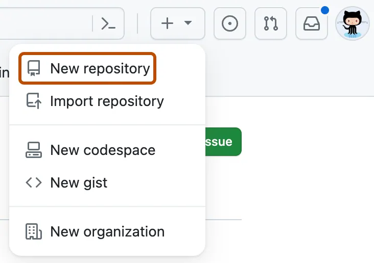

> :sparkles: This page serves as Quickstart for working with repositories. For a more comprehensive reference about Working with GitHub repositories, refer to [Creating and managing repositories](https://docs.github.com/en/repositories/creating-and-managing-repositories)

## Create a repository

GitHub repositories store a variety of projects. In this guide, you'll create a repository and commit your first change.

1. In the upper-right corner of any page, select \+, then click **New repository**.
    
2. Type a short, memorable name for your repository. For example, "hello-world".
   
3. Optionally, add a description of your repository. For example, "My first repository on GitHub"
4. Choose a repository visibility. In this course it must be **Private**
5. Select **Initialize this repository with a README**.
6. Click **Create repository**.

## Commit change using Web Interface

A [commit](https://docs.github.com/en/get-started/learning-about-github/github-glossary#commit) is like a snapshot of all the files in your project at a particular point in time.

1. In your repository's list of files, select **README.md**.
   
2. In the upper right corner of the file view, click _pen_ icon to open the file editor.
    
3. In the text box, type some information about yourself.
4. Above the new content, click **Preview**.
    
5. Review the changes you made to the file. If you select **Show diff**, you will see the new content in green.
    
6. Click **Commit** changes. In the "Commit message" field, type a short, meaningful commit message that describes the change you made to the file

## Sources

1. <cite>[Quickstart for repositories][1]</cite>

[1]: https://docs.github.com/en/repositories/creating-and-managing-repositories/quickstart-for-repositories
